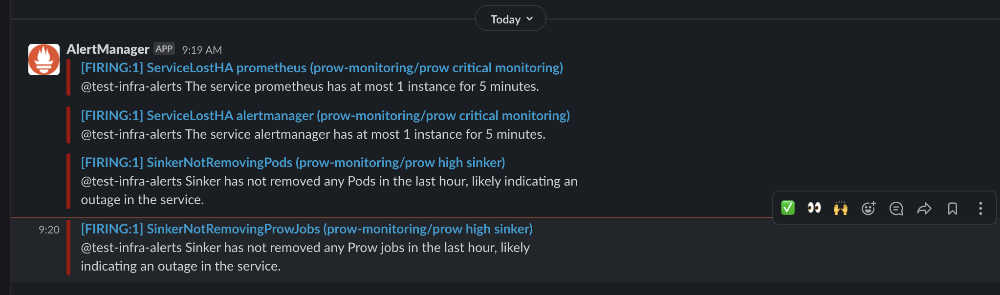

# Monitoring

This folder contains the manifest files for monitoring prow resources.

## Deploy

Cluster admins need to create `secret`s  manually for the slack workspace configmap.

```
### replace the sensitive inforamtion for the slack workspace in the files before executing:

$ kubectl create -f alertmanager/alertmanager-prow_secret.yaml

```

The grafana `Ingress` in [grafana_expose.yaml](grafana_expose.yaml) is using the ALB ingress controller, and is a pre-req for deploying.

A successful deploy will spawn a stack of monitoring for prow in namespace `prow-monitoring`: _prometheus_, _alertmanager_, and _grafana_.

_Add more dashboards_:

Suppose that there is an App running as a pod that exposes Prometheus metrics on port `n` and we want to include it into our prow-monitoring stack.
First step is to create a k8s-service to proxy port `n` if you have not done it yet.

### Add the service as target in Prometheus

Add a new `servicemonitors.monitoring.coreos.com` which proxies the targeting service into [prow_servicemonitors.yaml](./prow_servicemonitors.yaml), eg,
`servicemonitor` for `ghproxy`,

```
apiVersion: monitoring.coreos.com/v1
kind: ServiceMonitor
metadata:
  labels:
    app: ghproxy
  name: ghproxy
  namespace: prow-monitoring
spec:
  endpoints:
    - interval: 30s
      port: metrics
      scheme: http
  namespaceSelector:
    matchNames:
      - default
  selector:
    matchLabels:
      app: ghproxy

```

The `svc` should be available on prometheus web UI: `Status` &rarr; `Targets`.

_Note_ that the `servicemonitor` has to have label `app` as key (value could be an arbitrary string).

### Add a new grafana dashboard

Take a look at the existing dashboard in `grafana/` 

An example would be `grafana_dashboard_deck.yaml`

```
---
apiVersion: v1
kind: ConfigMap
metadata:
  name: grafana-dashboard-deck
  labels:
    grafana_dashboard: "true"
data:
  deck.json: |
    {
      "__inputs": [ ],
      "__requires": [ ],
      "annotations": {
          "list": [ ]
      },
...
```

We can build the grafana dashboard manually, and use the `export to json` button in grafana and add it as a configmap for the deployment. Then you need to add the corresponding volumemount to the grafana deployment

```yaml
        - mountPath: /grafana-dashboard-definitions/0/deck
          name: grafana-dashboard-deck
          readOnly: false
```

* Use the configMap above in [grafana_deployment.yaml](grafana_deployment.yaml).
## Access components' Web page

* For `grafana`, visit [monitoring.falco.org](https://monitoring.prow.k8s.io). Anonymous users are with read-only mode.
Use `adm` and the [password](https://github.com/kubernetes/test-infra/blob/master/config/prow/cluster/monitoring/grafana_deployment.yaml#L39-L45) to become admin.

## Development instances

For development purposes If the Prow instance does not publicly expose `grafana` it can still be accessed via [port-forwarding](https://kubernetes.io/docs/tasks/access-application-cluster/port-forward-access-application-cluster/). Run

```
kubectl -n prow-monitoring port-forward service/grafana 8080:80
```
then visit [localhost:8080](http://127.0.0.1:8080).


## Prometheus and Alertmanager

* For `prometheus` and `alertmanager`, there is no public domain configured based on the security
concerns (no authorization out of the box).
Cluster admins can use [k8s port-forward](https://kubernetes.io/docs/tasks/access-application-cluster/port-forward-access-application-cluster/) to
access the web.

    ```bash
    #Either use the makefile
    make pf-prometheus
    make pf-alertmanager

    #or kubectl commands
    $ kubectl -n prow-monitoring port-forward $( kubectl -n prow-monitoring get pods --selector app=prometheus -o jsonpath={.items[0].metadata.name} ) 9090
    $ kubectl -n prow-monitoring port-forward $( kubectl -n prow-monitoring get pods --selector app=alertmanager -o jsonpath={.items[0].metadata.name} ) 9093
    ```

    Then, visit [127.0.0.1:9090](http://127.0.0.1:9090) for the `prometheus` pod and [127.0.0.1:9093](http://127.0.0.1:9093) for the `alertmanager` pod.

    As a result of no public domain for those two components, some of the links on the UI do not work, eg, the links on the slack alerts.

## Slack Alerts and Tuning

Based off the alertmanager rules, we will see test-infra alerts coming in about issues such as prow microservices not responding, or issues such as prowjob failures which might be an indicator of larger infra issue.

### Warnings vs Alerts

In alertmanager we define the difference between alerts, and warnings as issues which impede prow (Hook is down), vs issues which may cause issue down the road. (GHproxy Volume is 85% full).

Tuning needs to be done to figure out the levels of each alert, but critical vs high vs medium as we go forward.

