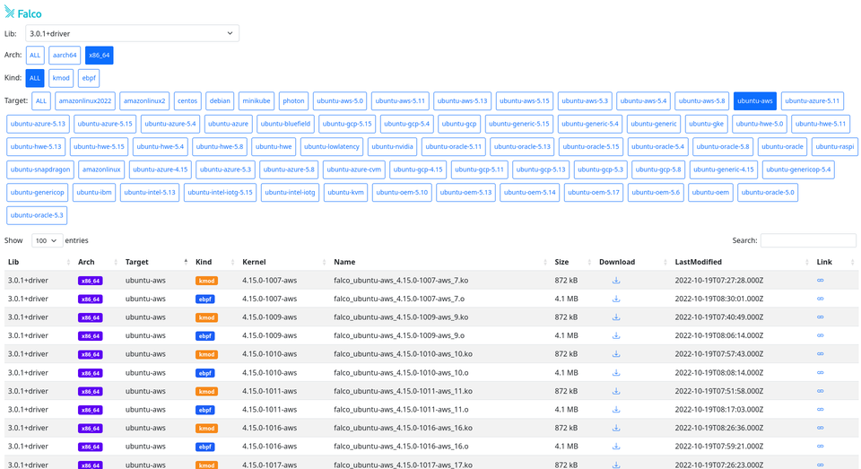

# driverkit build grid

This folder contains the configuration files for the driverkit build grid.

## Usage

Just make is enough! :heart:

```console
make
```

### Available make targets

- `all`: build all the Falco drivers (all the versions), for every supported distro, and every supported kernel release
- `validate`: validate Driverkit config files for building drivers for specific arch, kernel and target for all Falco lib versions
- `specific_target`: build the filtered driver versions
- `clean`: remove everything in the `output/` directory (except it, and its `.gitignore` file)
- `publish`: publish all the built Falco drivers (those existing in the `output/` directory) to bintray
- `publish_<driver_version>`: publish all the built Falco drivers to bintray filtering by the Falco driver version (those existing in the `output/<driver_version>` directory)
- `publish_s3`: publish all the built Falco drivers (those existing in the `output/` directory) to S3
- `publish_s3_<driver_version>`: publish all the built Falco drivers to S3 filtering by the Falco driver version (those existing in the `output/<driver_version>` directory)
- `cleanup`: delete from bintray the driver version no more supported (those present on bintray but not in the `config/` directory)
- `cleanup_s3`: delete from S3 the driver version no more supported (those present on S3 but not in the `config/` directory)
- `stats`: print counts about currently available Falco drivers

#### Specific target

In case you want to build the Falco drivers (all the available versions) for just a distro or a specific kernel or both, use the `specific_target` make target:

```console
make -e TARGET_DISTRO=amazonlinux2 specific_target
```

##### Available filters

These are the available filters as environment variables:

- `TARGET_ARCH`: a specific arch between { "x86_64", "aarch64" }
- `TARGET_VERSION`: a specific Falco driver version
- `TARGET_DISTRO`: a spefific Linux distribution
- `TARGET_KERNEL_RELEASE`: a specific Linux kernel release (i.e. the result of `uname -r`):
  - in <kernel_version>.<major_version>.<minor_version> format
  - in <kernel_version>.<major_version>.* format
  - in <kernel_version>.* format
- `TARGET_KERNEL_VERSION`: a specific Linux version (i.e. from the result of `uname -v`)
- `TARGET_KERNEL`: a specific Linux kernel release and kernel version, separated by underscore ('_'). Specifying it will override `TARGET_KERNEL_RELEASE` and `TARGET_KERNEL_VERSION`.

Notice all the filters are optional (except for `generate` where they are mandatory).

##### Examples

You can filter a specific distro with a specific kernel (i.e. 5.9.0 release and version #1):

```console
make -e TARGET_DISTRO="debian" -e TARGET_KERNEL="5.9.0_1" specific_target
```

> The result would be the same of:
> ```console
> make -e TARGET_DISTRO="debian" -e TARGET_KERNEL_RELEASE="5.9.0" -e TARGET_KERNEL_VERSION="1" specific_target
> ```

Or, you can ask it to make all the Falco drivers for all the kernel versions of the 5.9.0 kernel release:

```console
make -e TARGET_DISTRO="debian" -e TARGET_KERNEL_RELEASE="5.9.0" specific_target
```

Or, you can ask it to make all the Falco drivers for debian 5.x kernels.

```console
make -e TARGET_DISTRO="debian" -e TARGET_KERNEL="5.*" specific_target
```

In case you're only interested in a precise Falco driver version, you can filter by it too:

```console
make -e TARGET_VERSION="2aa88" -e TARGET_DISTRO="debian" -e TARGET_KERNEL="4.9.*" specific_target
```

Finally, notice you can use these filters also with the `stats` make target.

Eg.,

```console
make -e TARGET_DISTRO=debian stats
```

## FAQ

### Q: Where can I found the list all pre-compiled drivers?

A: Go to [https://download.falco.org/driver/site/index.html](https://download.falco.org/driver/site/index.html)



### Q: Falco doesn't find the kernel module/ eBPF probe for my OS, what do I do?

A: You can generate and contribute configurations for your OS, as follows:

- [Fork](https://docs.github.com/en/get-started/quickstart/fork-a-repo) this [repository](https://github.com/falcosecurity/test-infra)
- From the `driverkit` directory of the repository, run:
  ```shell
  make generate -e TARGET_DISTRO=<TARGET_DISTRO> -e TARGET_KERNEL=<TARGET_KERNEL>
  ```
  > Besides `$TARGET_DISTRO` and `$TARGET_KERNEL`, you can find more filters [here](#available-filters), that help you to target specific kernel releases.
  >
  > If you want the drivers for your local kernel, you can fill `$TARGET_KERNEL` with: `"$(uname -r)_$(uname -v | sed 's/#\([[:digit:]]\+\).*/\1/')"`.
  >
  > Available values for `$TARGET_DISTRO` can be found [here](https://github.com/falcosecurity/driverkit#supported-targets).

- Send a PR to this upstream repository, with the changes

The configurations are then consumed by [driverkit](https://github.com/falcosecurity/driverkit) in our [CI pipeline](../config/jobs).

You can find examples of configurations in this repository. The configuration paths are built as follows:

  `driverkit/config/<driver version>/<architecture>/<linux distribution>_<kernel release name>_<kernel build version>.yaml`.

You can also validate the configurations you generate with `make validate`, and using same filters used for `make generate` to target specific configurations.

You can find more info about the Driverkit Build Grid [here](#driverkit-build-grid).

It should be noted that the Driverkit Build Grid configurations are kept only for the last kernel-crawler's result, as the crawler represents the uniqe source of truth. Therefore, added configurations will be dropped on Driverkit Build Grid updates but published artifacts will not be cleaned up and will still remain available.

### Q: How do you publish new drivers?

A: If you have proper S3 permissions from Terraform or Prow, run

```console
make publish_s3
```

to publish the results after the build finishes.
